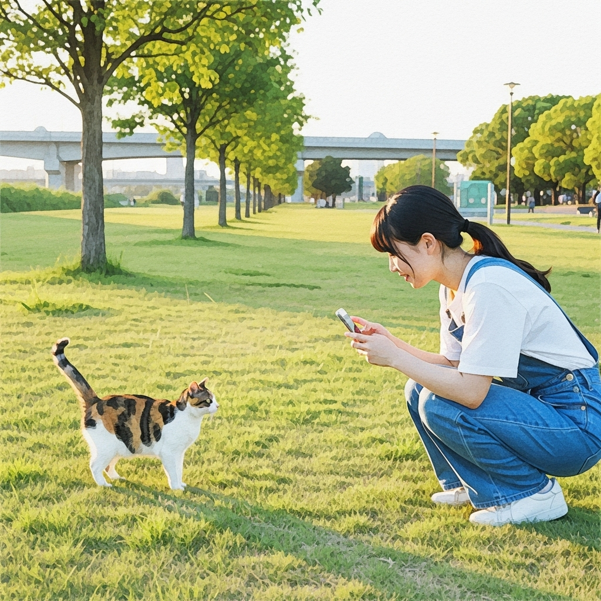

# ご利用方法

## 基本的な使い方

### 1. 地図の閲覧
- 地図を開くと、猫の写真と猫スポットがアイコンで表示されます
- 地図を拡大・縮小して、お気に入りのエリアを探索できます

### 2. 猫の詳細情報を確認
- 猫の写真アイコンをクリックすると、詳細情報が表示されます
- 猫の名前、特徴、投稿者のコメントなどを確認できます

### 3. コメントの投稿
- 猫の詳細画面から、その猫についてのコメントを投稿できます
- 他のユーザーとの情報共有にご活用ください

### 4. 猫スポットの情報確認
- 猫スポットのアイコンをクリックすると、店舗情報やアクセス方法が表示されます
- 猫カフェ、猫グッズショップ、猫の集会場所などの情報を確認できます

## 写真の投稿方法

### 投稿手順
1. 画面右側の「投稿」ボタンをクリック
2. 猫の写真を選択（位置情報付きの写真が必要です）
3. 必要に応じてコメントを入力
4. 「投稿」ボタンをクリックして完了

### 投稿時の注意点
- 写真には位置情報が含まれている必要があります
- 撮影時にGPS機能を有効にしてください
- 猫の写真のみを投稿してください（人物が写り込まないようご注意ください）

## よくある質問

**Q: 位置情報が含まれていない写真は投稿できますか？**
A: 申し訳ございませんが、位置情報が含まれていない写真は投稿できません。撮影時にGPS機能を有効にしてから撮影してください。

**Q: 投稿した写真を削除できますか？**
A: 現在、投稿後の写真削除機能は提供しておりません。投稿前に十分ご確認ください。

